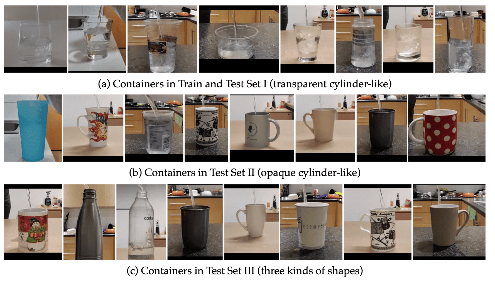

---
task_categories:
- audio-classification
- text-to-video
language:
- en
tags:
- audio-visual
- physical-properties
- pitch-estimation
pretty_name: Sound-of-Water 50
size_categories:
- n<1K
configs:
- config_name: default
  data_files:
  - split: train
    path: "splits/train.csv"
  - split: test_I
    path: "splits/test_I.csv"
  - split: test_II
    path: "splits/test_II.csv"
  - split: test_III
    path: "splits/test_III.csv"
---


<!-- #   -->
# 🚰 The Sound of Water: Inferring Physical Properties from Pouring Liquids

<!-- <p align="center">
  <a href="https://arxiv.org/abs/2411.11222" target="_blank">
    
  </a>
  &nbsp;&nbsp;&nbsp;
  <a target="_blank" href="https://colab.research.google.com/github/bpiyush/SoundOfWater/blob/main/playground.ipynb">
  
  </a>
  &nbsp;&nbsp;&nbsp;
  <a href="https://your_gradio_demo_link" target="_blank">
    
  </a>
</p> -->


This dataset is associated with the paper "The Sound of Water: Inferring Physical Properties from Pouring Liquids".

Arxiv link: https://arxiv.org/abs/2411.11222


<!-- Add a teaser image. -->
<p align="center">
  
</p>

*Key insight*: As water is poured, the fundamental frequency that we hear changes predictably over time as a function of physical properties (e.g., container dimensions).

**TL;DR**: We present a method to infer physical properties of liquids from *just* the sound of pouring. We show in theory how *pitch* can be used to derive various physical properties such as container height, flow rate, etc. Then, we train a pitch detection network (`wav2vec2`) using simulated and real data. The resulting model can predict the physical properties of pouring liquids with high accuracy. The latent representations learned also encode information about liquid mass and container shape.


##  📑 Table of Contents

- [🚰 The Sound of Water: Inferring Physical Properties from Pouring Liquids](#-the-sound-of-water-inferring-physical-properties-from-pouring-liquids)
  - [📑 Table of Contents](#-table-of-contents)
  - [📚 Dataset Overview](#-dataset-overview)
  - [🎥 Video and 🎧 audio samples](#-video-and--audio-samples)
  - [🗂️ Splits](#️-splits)
  - [📝 Annotations](#-annotations)
      - [Container measurements and other metadata](#container-measurements-and-other-metadata)
      - [Container bounding boxes](#container-bounding-boxes)
  - [🎬 YouTube samples](#-youtube-samples)
  - [📜 Citation](#-citation)
  - [🙏 Acknowledgements](#-acknowledgements)
  - [🙅🏻 Potential Biases](#-potential-biases)


## 📚 Dataset Overview

We collect a dataset of 805 clean videos that show the action of pouring water in a container. Our dataset spans over 50 unique containers made of 5 different materials, 4 different shapes and with hot and cold water. Some example containers are shown below.

<p align="center">
  
</p>

Download the dataset with:

```python
# Note: this shall take 5-10 mins.

# Optionally, disable progress bars
# os.environ["HF_HUB_DISABLE_PROGRESS_BARS"] = True

from huggingface_hub import snapshot_download
snapshot_download(
    repo_id="bpiyush/sound-of-water",
    repo_type="dataset",
    local_dir="/path/to/dataset/SoundOfWater",
)
```


The dataset is stored in the following directory structure:
```sh
SoundOfWater/
|-- annotations
|-- assets
|-- audios
|-- README.md
|-- splits
|-- videos
`-- youtube_samples

6 directories, 1 file
```


## Demo

Check out the demo [here](https://huggingface.co/spaces/bpiyush/SoundOfWater). You can upload a video of pouring and the model estimates pitch and physical properties.

## 🎥 Video and 🎧 audio samples

The video and audio samples are stored in the `./videos/` and `./audios/` directories, respectively.
Note that we have trimmed the videos between the precise start and end of the pouring action.
If you need untrimmed videos, please contact us separately and we may be able to help.

The metadata for each video is a row in "./annotations/localisation.csv". 

## 🗂️ Splits

We create four splits of the dataset.
All of the splits can be found in the `./splits/` directory.
The splits are as follows:
<table>
<style>
    table td:nth-child(n+2), table th:nth-child(n+2) {
      text-align: center;
    }
</style>
  <tr>
    <th>Split</th>
    <th colspan="2">Opacity</th>
    <th colspan="3">Shapes</th>
    <th>Containers</th>
    <th>Videos</th>
    <th>Description</th>
  </tr>
  <tr>
    <td></td>
    <td><i>Transparent</i></td>
    <td><i>Opaque</i></td>
    <td><i>Cylinder</i></td>
    <td><i>Semi-cone</i></td>
    <td><i>Bottle</i></td>
    <td></td>
    <td></td>
    <td></td>
  </tr>
  <tr>
    <td>Train</td>
    <td>✓</td>
    <td>✗</td>
    <td>✓</td>
    <td>✓</td>
    <td>✗</td>
    <td>18</td>
    <td>195</td>
    <td>Transparent cylinder-like containers</td>
  </tr>
  <tr>
    <td>Test I</td>
    <td>✓</td>
    <td>✗</td>
    <td>✓</td>
    <td>✓</td>
    <td>✗</td>
    <td>13</td>
    <td>54</td>
    <td>Test set with seen containers</td>
  </tr>
  <tr>
    <td>Test II</td>
    <td>✗</td>
    <td>✓</td>
    <td>✓</td>
    <td>✓</td>
    <td>✗</td>
    <td>19</td>
    <td>327</td>
    <td>Test set with unseen containers</td>
  </tr>
  <tr>
    <td>Test III</td>
    <td>✓</td>
    <td>✓</td>
    <td>✓</td>
    <td>✓</td>
    <td>✓</td>
    <td>25</td>
    <td>434</td>
    <td>Shape clf. with unseen containers</td>
  </tr>
</table>


## 📝 Annotations

An example row with metadata for a video looks like:
```json
{
    "video_id": "VID_20240116_230040",
    "start_time": 2.057,
    "end_time": 16.71059,
    "setting": "ws-kitchen",
    "bg-noise": "no",
    "water_temperature": "normal",
    "liquid": "water_normal",
    "container_id": "container_1",
    "flow_rate_appx": "constant",
    "comment": null,
    "clean": "yes",
    "time_annotation_mode": "manual",
    "shape": "cylindrical",
    "material": "plastic",
    "visibility": "transparent",
    "example_video_id": "VID_20240116_230040",
    "measurements": {
        "diameter_bottom": 5.7,
        "diameter_top": 6.3,
        "net_height": 19.7,
        "thickness": 0.32
    },
    "hyperparameters": {
        "beta": 0.0
    },
    "physical_parameters": null,
    "item_id": "VID_20240116_230040_2.1_16.7"
}
```

#### Container measurements and other metadata

All metadata for the containers is stored in the `./annotations/` file.

| **File** | **Description** |
| --- | --- |
| `localisation.csv` | Each row is metadata (e.g., container) for each video. |
| `containers.yaml` | Metadata for each container. |
| `liquids.yaml` | Metadata for each liquid. |
| `materials.yaml` | Metadata for each material. |


#### Container bounding boxes

The bounding box annotations for containers are stored here: `./annotations/container_bboxes/`. 
These are generated in a zero-shot manner using [LangSAM](https://github.com/luca-medeiros/lang-segment-anything).


## 🎬 YouTube samples

We also provide 4 samples searched from YouTube. These are used for qualitative evaluation.


<!-- Add a citation -->
## 📜 Citation

If you find this repository useful, please consider giving a star ⭐ and citation

```bibtex
@article{sound_of_water_bagad,
  title={The {S}ound of {W}ater: {I}nferring {P}hysical {P}roperties from {P}ouring {L}iquids},
  author={Bagad, Piyush and Tapaswi, Makarand and Snoek, Cees G. M. and Zisserman, Andrew},
  journal={arXiv},
  year={2024}
}

@inproceedings{
      bagad2024soundofwater,
      title={The {S}ound of {W}ater: {I}nferring {P}hysical {P}roperties from {P}ouring {L}iquids},
      author={Bagad, Piyush and Tapaswi, Makarand and Snoek, Cees G. M. and Zisserman, Andrew},
      booktitle={ICASSP},
      year={2025}
}
```


<!-- Add acknowledgements, license, etc. here. -->
## 🙏 Acknowledgements

* We thank Ashish Thandavan for support with infrastructure and Sindhu
Hegde, Ragav Sachdeva, Jaesung Huh, Vladimir Iashin, Prajwal KR, and Aditya Singh for useful
discussions.
* This research is funded by EPSRC Programme Grant VisualAI EP/T028572/1, and a Royal Society Research Professorship RP / R1 / 191132.

We also want to highlight closely related work that could be of interest:

* [Analyzing Liquid Pouring Sequences via Audio-Visual Neural Networks](https://gamma.cs.unc.edu/PSNN/). IROS (2019).
* [Human sensitivity to acoustic information from vessel filling](https://psycnet.apa.org/record/2000-13210-019). Journal of Experimental Psychology (2020).
* [See the Glass Half Full: Reasoning About Liquid Containers, Their Volume and Content](https://arxiv.org/abs/1701.02718). ICCV (2017).
* [CREPE: A Convolutional Representation for Pitch Estimation](https://arxiv.org/abs/1802.06182). ICASSP (2018).

## 🙅🏻 Potential Biases

The dataset is recorded on a standard mobile phone from the authors themselves. It is recorded in a  indoor setting. As far as possible, we have tried to not include any personal information in the videos. Thus, it is unlikely to include harmdul biases. Plus, the scale of the dataset is small and is not likely to be used for training large models.
